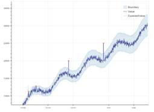

**Azure ML : Anomaly Detection Description**

**Overview**

Anomaly Detection is an API built with Azure Machine Learning that is useful for detecting different types of anomalous patterns in your time series data. The API assigns an anomaly score to each data point in the time series, which can be used for generating alerts, monitoring through dashboards or connecting with your ticketing systems.

The [Anomaly Detection API](https://docs.microsoft.com/en-us/azure/machine-learning/machine-learning-apps-anomaly-detection-api) can detect the following types of anomalies on time series data:

*   _Spikes and Dips:_ For example, when monitoring the number of login failures to a service or number of checkouts in an e-commerce site, unusual spikes or dips could indicate security attacks or service disruptions.
*   _Positive and negative trends:_ When monitoring memory usage in computing, for instance, shrinking free memory size is indicative of a potential memory leak; when monitoring service queue length, a persistent upward trend may indicate an underlying software issue.
*   _Level changes and changes in dynamic range of values:_ For example, level changes in latencies of a service after a service upgrade or lower levels of exceptions after upgrade can be interesting to monitor.

**Applications / Features**

The machine learning based API enables:

*   _Flexible and robust detection:_ The anomaly detection models allow users to configure sensitivity settings and detect anomalies among seasonal and non-seasonal data sets. Users can adjust the anomaly detection model to make the detection API less or more sensitive according to their needs. This would mean detecting the less or more visible anomalies in data with and without seasonal patterns. 
*   _Scalable and timely detection:_ The traditional way of monitoring with preset thresholds set by experts' domain knowledge are costly and not scalable to millions of dynamically changing data sets. The anomaly detection models in this API are learned and models are tuned automatically from both historical and real-time data.
*   _Proactive and actionable detection:_ Slow trend and level change detection can be applied for early anomaly detection. The early abnormal signals detected can be used to direct humans to investigate and act on the problem areas.  In addition, root cause analysis models and alerting tools can be developed on top of this anomaly detection API service.

**Model Metadata**

Domain : Machine Learning

Application : Machine Learning

Industry : General

Input Data Format : Seasonal and Non Seasonal Datasets

**Pricing**

Instance

Features

Price

Free - Web/Container

Univariate anomaly detection

20000 transactions free per month

Standard - Web/Container

Univariate anomaly detection

Multivariate anomaly detection

$0.314 per 1,000 transactions

Free

https://azure.microsoft.com/en-us/pricing/details/cognitive-services/anomaly-detector/

**Documentation Link**

[https://docs.microsoft.com/en-us/azure/cognitive-services/anomaly-detector/](https://docs.microsoft.com/en-us/azure/cognitive-services/anomaly-detector/)