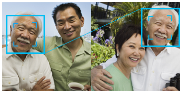

**Azure ML : Face API Description**

**Overview**

Face APIs provide state-of-the-art algorithms to process face images, like face detection with gender and age prediction, recognition, alignment and other application level features. The Azure Face service provides AI algorithms that detect, recognize, and analyze human faces in images. Facial recognition software is important in many different scenarios, such as identity verification, touchless access control, and face blurring for privacy.

**Applications / Features**

Face detection with attributes extraction

You will get the detected faces with rectangles indicating the face positions and a series of face related attributes, include landmarks, pose, gender and age by giving an image.

Face Verification
-----------------

Given two detected faces, you will get result indicates whether the two requested faces belong to the same person.

Face Grouping
-------------

Provide service a set of unknown faces, it will automatically divide them into several groups based on similarity:

Face Identification
-------------------

You can use Face Identification to recognize persons' identities.

**Model Metadata**

Domain : Vision

Application : Face Tagging

Industry : General

Input Data Format : Image

**API Demo Link**

  

[https://azure.microsoft.com/en-us/services/cognitive-services/face/#demo](https://azure.microsoft.com/en-us/services/cognitive-services/face/#demo)

**Pricing**

Instance

Transaction Per Second

Features

Price

Free - Web/Container

20 transactions per minute

Face Detection  
Face Verification  
Face Identification  
Face Grouping  
Similar Face Search

30,000 transactions free per month

Standard - Web/Container

10 TPS

Face Detection  
Face Verification  
Face Identification  
Face Grouping  
Similar Face Search

0-1M transactions -$1 per 1,000 transactions1-5M transactions -$0.80 per 1,000 transactions5-100M transactions -$0.60 per 1,000 transactions100M+ transactions -$0.40 per 1,000 transactions

https://azure.microsoft.com/en-us/pricing/details/cognitive-services/face-api/

**Documentation Link**

[https://docs.microsoft.com/en-us/azure/cognitive-services/face/overview](https://docs.microsoft.com/en-us/azure/cognitive-services/face/overview)