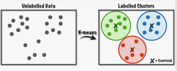

**Azure ML : Clustering - Description**

**Overview**

This experiment clusters similar companies into same group given their Wikipedia articles and can be used to assign cluster to new company.

**Description**

This experiment demonstrates how to use the K-Means clustering algorithm to perform segmentation on companies from the Standard & Poor (S&P) 500 index, based on the text of Wikipedia articles about each company.

**Model Metadata**

Domain : Machine Learning

Application : Machine Learning

Industry : General

Input Data Format : Tabular Datasets

Algorithm : K-Means Clustering

**Data**

The articles from Wikipedia were pre-processed outside Azure ML Studio to extract and partially clean text content related to each company. The processing included:

*   Removing wiki formatting
*   Removing non-alphanumeric characters
*   Converting all text to lowercase
*   Adding company categories, where known

For some companies, articles could not be found; therefore the number of records is less than 500.

**Experiment Link**

[https://studio.azureml.net/community/unpack?packageUri=https%3a%2f%2fstorage.azureml.net%2fdirectories%2f7ff9bbf74d0b4dbbb08fbfb4ec5b923d%2fitems&communityUri=https%3a%2f%2fgallery.azure.ai%2fDetails%2fclustering-find-similar-companies-6&entityId=Clustering-Find-similar-companies-6](https://studio.azureml.net/community/unpack?packageUri=https%3a%2f%2fstorage.azureml.net%2fdirectories%2f7ff9bbf74d0b4dbbb08fbfb4ec5b923d%2fitems&communityUri=https%3a%2f%2fgallery.azure.ai%2fDetails%2fclustering-find-similar-companies-6&entityId=Clustering-Find-similar-companies-6)