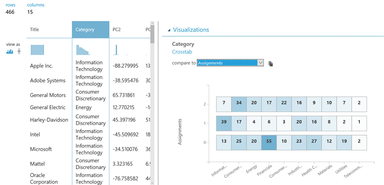

**Azure ML : Customer Churn Further Reading**

**Objective**

This experiment clusters similar companies into same group given their Wikipedia articles and can be used to assign cluster to new company.

**Prerequisites**

*   Azure subscription - [Create one for free](https://azure.microsoft.com/free/cognitive-services/)

**Testing Link**

[https://studio.azureml.net/community/unpack?packageUri=https%3a%2f%2fstorage.azureml.net%2fdirectories%2f7ff9bbf74d0b4dbbb08fbfb4ec5b923d%2fitems&communityUri=https%3a%2f%2fgallery.azure.ai%2fDetails%2fclustering-find-similar-companies-6&entityId=Clustering-Find-similar-companies-6](https://studio.azureml.net/community/unpack?packageUri=https%3a%2f%2fstorage.azureml.net%2fdirectories%2f7ff9bbf74d0b4dbbb08fbfb4ec5b923d%2fitems&communityUri=https%3a%2f%2fgallery.azure.ai%2fDetails%2fclustering-find-similar-companies-6&entityId=Clustering-Find-similar-companies-6)

**Model**

First, the contents of each Wiki article were passed to the Feature Hashing module, which tokenizes the text string and then transforms the data into a series of numbers, based on the hash value of each token.

Even with this transformation, the dimensionality of the data is too high and sparse to be used by the K-Means clustering algorithm directly. Therefore, Principal Component Analysis (PCA) was applied using a custom R script in the Execute R Script module to reduce the dimensionality to 10 variables. You can review the result of PCA by double-clicking the right-hand output of the Execute R Script R module.

From trial and error, we learned that the first variable in the PCA transformed data had the highest variance and appears to have had a detrimental effect on clustering. Therefore, we removed it from the feature set using Project Columns.

Once the data was prepared, we created several different instances of the K-Means Clustering module and trained models on the text data. By trial and error, we found that the best results were obtained with 3 clusters, but models using 4 and 5 clusters were also tried.

Finally, we used Metadata Editor to change the cluster labels into categorical values, and saved the results in CSV format for downloading, using Convert to CSV module.

**Results**

To view the results from the sample experiment:

1.  Right-click the output from **Metadata Editor** and select **Visualize**.
2.  Plot the Category column (a known feature from the Wikipedia data) against the Assignments columns.

The three clusters that we obtained correspond roughly to three plausible categories. Note that the clusters are not clearly delineated.

