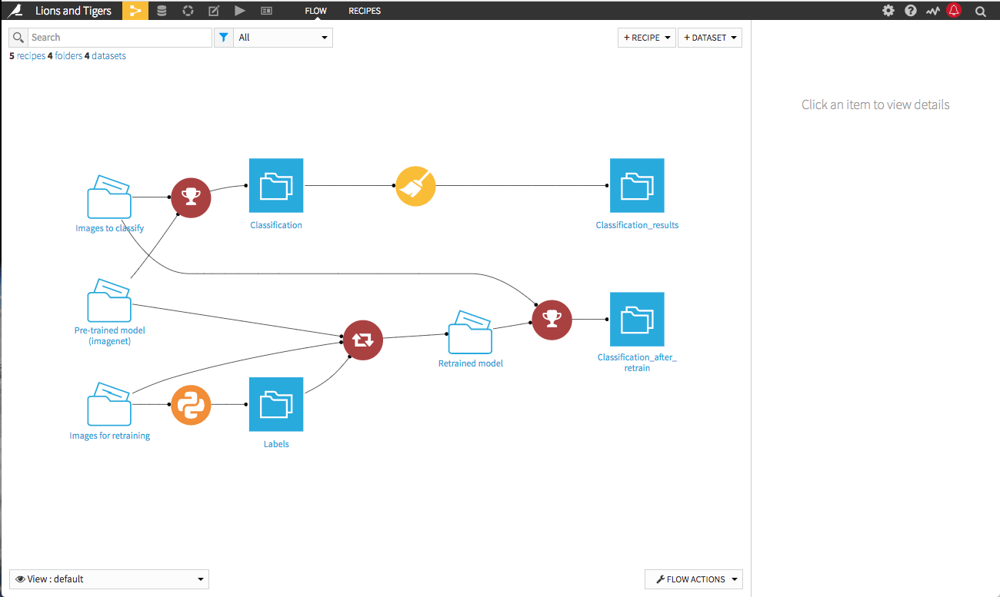
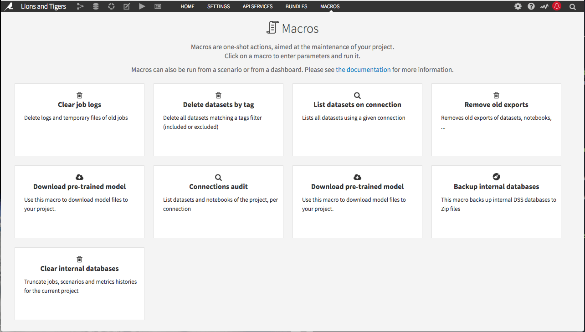
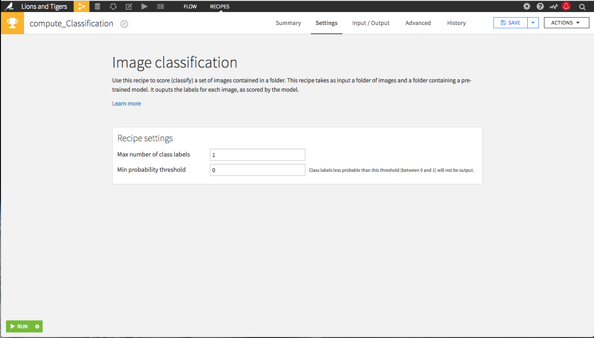

# Deep Learning for Image Classification

The goal of the project is to classify images into two animals from the family Felidae: lions or tigers.
We have a list of [images in a managed folder](https://gallery.dataiku.com/projects/LIONANDTIGER/managedfolder/Ih9S2Mq5/view/) to classify.

First, we are going to classify these images using a pre-trained model. Then, we will retrain the model to try to improve our accuracy.

## Explore This Sample Project

### The Flow
Start by looking at the flow. The inputs are a folder containing images to be classified, a folder containing a pre-trained deep learning model (see below), and a folder containing images to retrain the model.

[**Explore here**](https://gallery.dataiku.com/projects/LIONANDTIGER/flow/)

### Downloading Pre-Trained Models
The plugin includes a macro for downloading a pre-trained deep learning model. To add a pre-trained deep learning model to the flow, run the macro and look for the managed folder it creates in the flow.

[**Explore here**](https://gallery.dataiku.com/projects/LIONANDTIGER/managedfolder/Jv4WSAUt/view/)

### Classifying images
The plugin includes a recipe for classifying images with a trained model. It takes as inputs a folder of images to classify and a model for classifying them. The output dataset, with some light preparation, contains the predictions.

[**Explore here**](https://gallery.dataiku.com/projects/LIONANDTIGER/datasets/Classification_results/explore/)

### Retraining a Model
The plugin includes a recipe for retraining a model. It takes as inputs the pre-trained model, a folder of images to do the retraining, and a dataset of labels for the images. The output dataset, with some light preparation, contains the predictions.

[**Explore here**](https://gallery.dataiku.com/projects/LIONANDTIGER/datasets/Classification_after_retrain_results/explore/)

