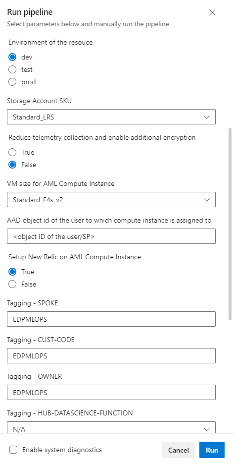

# Azure Machine Learning ARM Template Automated Deployment with NewRelic Setup
This automation template covers:
1. Provisioning of prerequisite resources for Azure Machine Learning (AML) Workspace and AML Workspace itself.
2. Cloud resource provisioned according to standardized naming and tagging convention.
3. NewRelic installation setup script at AML compute instance.

## Trigger the automation pipeline
An intuitive parameter form-like pop ups before running the pipeline. These information is crucial to ensure the resources provisioned is following as the service request by end markets.

## By the completion of the automation, you will get:
1. Resources created following the configuration, naming and tagging convention as parameter input in the automation pipeline.

2. NewRelic setup at Azure Machine Learning compute instance.

## Get started
To get started, click [Quickstart using Azure Pipelines](https://dev.azure.com/batdigital/OneDRA/_build?definitionId=6805).