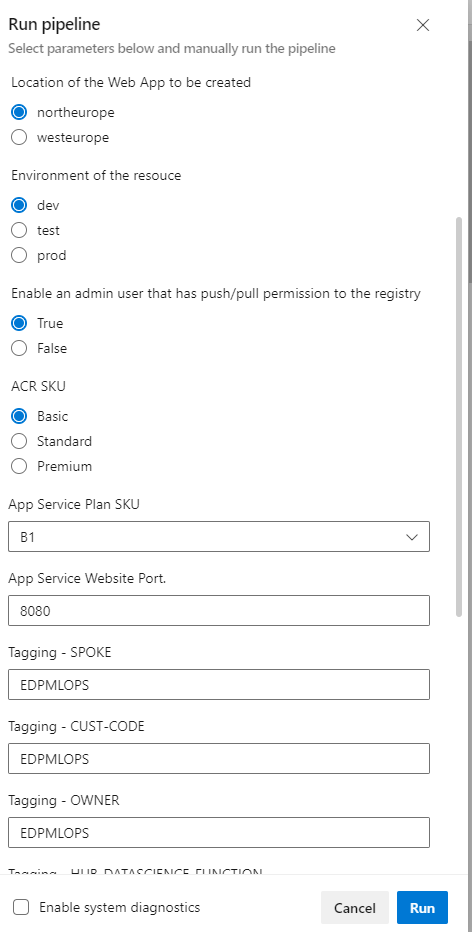

# Dash App Deployment (end-to-end)
This automation template covers:
1. Provisioning of Dash App Cloud Resources (App Service Plan, App Service and Azure Container Registry) - configuration of the infrastructure such as naming, tagging, location, SKU can be done in the pipeline.
2. Cloud resource provisioned according to standardized naming and tagging convention.
3. Setting up of Azure Git repo for data scientist for their storage of development code.
4. An ADO pipeline yaml are in place when the Git repo is initialized.

## Trigger the automation pipeline
An intuitive parameter form-like pop ups before running the pipeline. These information is crucial to ensure the resources provisioned is following as the service request by end markets.

## By the completion of the automation, you will get:
1. Resources created following the configuration, naming and tagging convention as parameter input in the automation pipeline.

2. Repository intialized based on the naming convention along with branching policy and CI/CD pipeline yaml in place.

## Get started
To get started, click [Quickstart using Azure Pipelines](https://dev.azure.com/batdigital/OneDRA/_build?definitionId=6651).